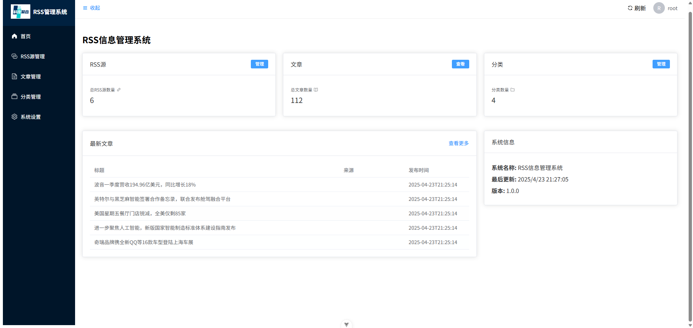
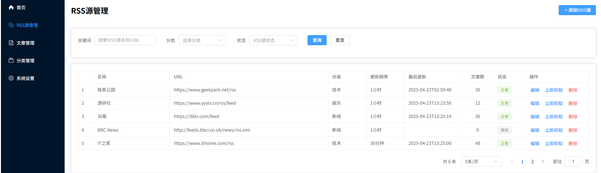
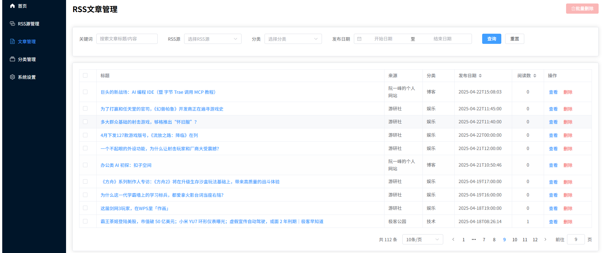

# RSS信息管理系统

<div align="center">
  <!-- 这里可以放置Logo图片 -->
  <h3>基于Vue 3的现代RSS阅读与管理平台</h3>
</div>

## 📖 项目简介

RSS信息管理系统是一个基于Vue 3 + Vite + Element Plus开发的现代化Web应用，为用户提供RSS源的订阅、管理和内容阅读功能。本系统可以自动抓取RSS源内容，并提供分类管理、文章查看、内容筛选等功能，是信息爱好者高效获取和管理在线内容的理想工具。

## ✨ 主要特性

- 🔄 **RSS源管理**：添加、编辑、删除RSS源，支持手动和自动抓取
- 📑 **文章管理**：浏览、查看、标记和筛选文章内容
- 📂 **分类功能**：对RSS源进行分类管理
- 📊 **统计仪表盘**：直观展示系统数据和状态
- 🔧 **系统设置**：自定义系统参数
- 🔐 **用户认证**：支持用户登录、注册和权限控制

## 🛠️ 技术栈

- **前端框架**：[Vue 3](https://v3.vuejs.org/) + [Vite](https://vitejs.dev/)
- **UI组件**：[Element Plus](https://element-plus.org/)
- **路由管理**：[Vue Router](https://router.vuejs.org/)
- **HTTP请求**：[Axios](https://axios-http.com/)
- **状态管理**：Vue 3 Composition API

## 🖼️ 项目预览

<!-- 这里可以添加项目截图，建议后续添加3-4张核心功能截图 -->




## 🚀 快速开始

### 环境要求

- Node.js >= 14.0.0
- npm >= 6.0.0

### 安装与运行

```bash
# 克隆项目
git clone https://github.com/你的用户名/rss-management-system.git

# 进入项目目录
cd rss-management-system

# 安装依赖
npm install

# 启动开发服务器
npm run dev

# 构建生产版本
npm run build
```

### 配置

项目主要配置在以下文件中：

- `vite.config.js` - Vite配置
- `.env` - 环境变量（如API基础URL等）

## 📁 项目结构

```
src/
├── api/                # API接口请求
│   ├── article.js      # 文章相关API
│   ├── auth.js         # 认证相关API
│   ├── category.js     # 分类相关API
│   ├── dashboard.js    # 仪表盘相关API
│   ├── request.js      # Axios请求封装
│   ├── rssSource.js    # RSS源相关API
│   └── settings.js     # 设置相关API
├── assets/             # 静态资源
│   └── logo.png        # 系统Logo
├── components/         # 通用组件
│   ├── SideMenu.vue    # 侧边栏导航组件
│   └── TopHeader.vue   # 顶部导航栏组件
├── router/             # 路由配置
│   └── index.js        # 路由定义与权限控制
├── views/              # 页面视图
│   ├── CategoriesView.vue  # 分类管理页面
│   ├── HomeView.vue        # 首页/仪表盘
│   ├── LoginView.vue       # 登录/注册页面
│   ├── RssArticlesView.vue # RSS文章管理页面
│   ├── RssSourcesView.vue  # RSS源管理页面
│   └── SettingsView.vue    # 系统设置页面
├── App.vue             # 根组件
└── main.js             # 应用入口
```

## 📝 后端API接口规范

所有API请求基础路径: `/api`

### 1. 认证接口

#### 登录
- **URL**: `/auth/login`
- **方法**: `POST`
- **参数**: 
  ```json
  {
    "username": "用户名",
    "password": "密码",
    "remember": true|false
  }
  ```
- **返回**:
  ```json
  {
    "code": 200,
    "message": "登录成功",
    "data": {
      "token": "JWT令牌",
      "user": {
        "id": "用户ID",
        "username": "用户名",
        "email": "邮箱"
      }
    }
  }
  ```

#### 注册
- **URL**: `/auth/register`
- **方法**: `POST`
- **参数**:
  ```json
  {
    "username": "用户名",
    "email": "邮箱",
    "password": "密码"
  }
  ```
- **返回**:
  ```json
  {
    "code": 200,
    "message": "注册成功",
    "data": null
  }
  ```

#### 登出
- **URL**: `/auth/logout`
- **方法**: `POST`
- **参数**: 无
- **返回**:
  ```json
  {
    "code": 200,
    "message": "登出成功",
    "data": null
  }
  ```

#### 检查登录状态
- **URL**: `/auth/check`
- **方法**: `GET`
- **参数**: 无
- **返回**:
  ```json
  {
    "code": 200,
    "message": "已登录",
    "data": {
      "user": {
        "id": "用户ID",
        "username": "用户名",
        "email": "邮箱"
      }
    }
  }
  ```

### 2. RSS源管理接口

#### 获取RSS源列表
- **URL**: `/rss/sources`
- **方法**: `GET`
- **参数**:
  - `page`: 当前页码
  - `pageSize`: 每页数量
  - `keyword`: 搜索关键词(可选)
  - `category`: 分类ID(可选)
  - `status`: 状态(可选)
- **返回**:
  ```json
  {
    "code": 200,
    "message": "success",
    "data": {
      "total": 100,
      "list": [
        {
          "id": "源ID",
          "name": "源名称",
          "url": "RSS URL",
          "category": {"id": "分类ID", "name": "分类名称"},
          "description": "描述",
          "lastFetchTime": "最后抓取时间",
          "status": "状态",
          "articleCount": 100
        }
      ]
    }
  }
  ```

#### 添加RSS源
- **URL**: `/rss/sources`
- **方法**: `POST`
- **参数**:
  ```json
  {
    "name": "源名称",
    "url": "RSS URL",
    "categoryId": "分类ID",
    "description": "描述",
    "fetchInterval": 30
  }
  ```
- **返回**:
  ```json
  {
    "code": 200,
    "message": "添加成功",
    "data": {
      "id": "新增源ID"
    }
  }
  ```

#### 更新RSS源
- **URL**: `/rss/sources/:id`
- **方法**: `PUT`
- **参数**:
  ```json
  {
    "name": "源名称",
    "url": "RSS URL",
    "categoryId": "分类ID",
    "description": "描述",
    "fetchInterval": 30,
    "status": "状态"
  }
  ```
- **返回**:
  ```json
  {
    "code": 200,
    "message": "更新成功",
    "data": null
  }
  ```

#### 删除RSS源
- **URL**: `/rss/sources/:id`
- **方法**: `DELETE`
- **参数**: 无
- **返回**:
  ```json
  {
    "code": 200,
    "message": "删除成功",
    "data": null
  }
  ```

#### 立即抓取RSS源
- **URL**: `/rss/sources/:id/fetch`
- **方法**: `POST`
- **参数**: 无
- **返回**:
  ```json
  {
    "code": 200,
    "message": "抓取任务已提交",
    "data": {
      "taskId": "任务ID"
    }
  }
  ```

### 3. 文章管理接口

#### 获取文章列表
- **URL**: `/rss/articles`
- **方法**: `GET`
- **参数**:
  - `page`: 当前页码
  - `pageSize`: 每页数量
  - `keyword`: 搜索关键词(可选)
  - `source`: RSS源ID(可选)
  - `category`: 分类ID(可选)
  - `startDate`: 开始日期(可选)
  - `endDate`: 结束日期(可选)
- **返回**:
  ```json
  {
    "code": 200,
    "message": "success",
    "data": {
      "total": 1000,
      "list": [
        {
          "id": "文章ID",
          "title": "文章标题",
          "link": "原文链接",
          "pubDate": "发布日期",
          "source": {"id": "源ID", "name": "源名称"},
          "summary": "摘要",
          "status": "状态",
          "isRead": true|false
        }
      ]
    }
  }
  ```

#### 获取文章详情
- **URL**: `/rss/articles/:id`
- **方法**: `GET`
- **参数**: 无
- **返回**:
  ```json
  {
    "code": 200,
    "message": "success",
    "data": {
      "id": "文章ID",
      "title": "文章标题",
      "link": "原文链接",
      "pubDate": "发布日期",
      "source": {"id": "源ID", "name": "源名称"},
      "content": "文章内容",
      "author": "作者",
      "categories": ["分类1", "分类2"],
      "status": "状态",
      "isRead": true|false
    }
  }
  ```

#### 更新文章信息
- **URL**: `/rss/articles/:id`
- **方法**: `PUT`
- **参数**:
  ```json
  {
    "status": "状态",
    "isRead": true|false,
    "isStarred": true|false
  }
  ```
- **返回**:
  ```json
  {
    "code": 200,
    "message": "更新成功",
    "data": null
  }
  ```

#### 删除文章
- **URL**: `/rss/articles/:id`
- **方法**: `DELETE`
- **参数**: 无
- **返回**:
  ```json
  {
    "code": 200,
    "message": "删除成功",
    "data": null
  }
  ```

#### 批量删除文章
- **URL**: `/rss/articles/batch`
- **方法**: `DELETE`
- **参数**:
  ```json
  {
    "ids": ["文章ID1", "文章ID2"]
  }
  ```
- **返回**:
  ```json
  {
    "code": 200,
    "message": "批量删除成功",
    "data": null
  }
  ```

#### 获取最新文章
- **URL**: `/rss/articles/latest`
- **方法**: `GET`
- **参数**:
  - `limit`: 获取数量(可选，默认5)
- **返回**:
  ```json
  {
    "code": 200,
    "message": "success",
    "data": [
      {
        "id": "文章ID",
        "title": "文章标题",
        "link": "原文链接",
        "pubDate": "发布日期",
        "source": {"id": "源ID", "name": "源名称"}
      }
    ]
  }
  ```

### 4. 分类管理接口

#### 获取分类列表
- **URL**: `/categories`
- **方法**: `GET`
- **参数**: 无
- **返回**:
  ```json
  {
    "code": 200,
    "message": "success",
    "data": [
      {
        "id": "分类ID",
        "name": "分类名称",
        "count": 10,
        "description": "分类描述"
      }
    ]
  }
  ```

#### 添加分类
- **URL**: `/categories`
- **方法**: `POST`
- **参数**:
  ```json
  {
    "name": "分类名称",
    "description": "分类描述"
  }
  ```
- **返回**:
  ```json
  {
    "code": 200,
    "message": "添加成功",
    "data": {
      "id": "新增分类ID"
    }
  }
  ```

#### 更新分类
- **URL**: `/categories/:id`
- **方法**: `PUT`
- **参数**:
  ```json
  {
    "name": "分类名称",
    "description": "分类描述"
  }
  ```
- **返回**:
  ```json
  {
    "code": 200,
    "message": "更新成功",
    "data": null
  }
  ```

#### 删除分类
- **URL**: `/categories/:id`
- **方法**: `DELETE`
- **参数**: 无
- **返回**:
  ```json
  {
    "code": 200,
    "message": "删除成功",
    "data": null
  }
  ```

### 5. 系统设置接口

#### 获取系统设置
- **URL**: `/settings`
- **方法**: `GET`
- **参数**: 无
- **返回**:
  ```json
  {
    "code": 200,
    "message": "success",
    "data": {
      "systemName": "系统名称",
      "defaultFetchFrequency": 30,
      "maxArticleAge": 30,
      "cleanupInterval": 24,
      "theme": "light"
    }
  }
  ```

#### 更新系统设置
- **URL**: `/settings`
- **方法**: `PUT`
- **参数**:
  ```json
  {
    "systemName": "系统名称",
    "defaultFetchFrequency": 30,
    "maxArticleAge": 30,
    "cleanupInterval": 24,
    "theme": "light"
  }
  ```
- **返回**:
  ```json
  {
    "code": 200,
    "message": "更新成功",
    "data": null
  }
  ```

#### 获取用户信息
- **URL**: `/user/info`
- **方法**: `GET`
- **参数**: 无
- **返回**:
  ```json
  {
    "code": 200,
    "message": "success",
    "data": {
      "id": "用户ID",
      "username": "用户名",
      "email": "邮箱",
      "avatar": "头像URL"
    }
  }
  ```

#### 更新用户信息
- **URL**: `/user/info`
- **方法**: `PUT`
- **参数**:
  ```json
  {
    "email": "邮箱",
    "avatar": "头像URL",
    "nickname": "昵称"
  }
  ```
- **返回**:
  ```json
  {
    "code": 200,
    "message": "更新成功",
    "data": null
  }
  ```

#### 修改密码
- **URL**: `/user/password`
- **方法**: `PUT`
- **参数**:
  ```json
  {
    "oldPassword": "旧密码",
    "newPassword": "新密码"
  }
  ```
- **返回**:
  ```json
  {
    "code": 200,
    "message": "修改成功",
    "data": null
  }
  ```

### 6. 仪表盘接口

#### 获取仪表盘统计数据
- **URL**: `/dashboard/statistics`
- **方法**: `GET`
- **参数**: 无
- **返回**:
  ```json
  {
    "code": 200,
    "message": "success",
    "data": {
      "totalSources": 100,
      "totalArticles": 5000,
      "todayNewArticles": 50,
      "categoriesCount": 10,
      "fetchStats": {
        "success": 80,
        "failed": 20
      }
    }
  }
  ```

## 🤝 贡献指南

欢迎贡献代码，提交问题和功能请求！以下是如何开始：

1. Fork 该仓库
2. 创建您的特性分支：`git checkout -b feature/my-new-feature`
3. 提交您的更改：`git commit -am 'Add some feature'`
4. 推送到分支：`git push origin feature/my-new-feature`
5. 提交拉取请求

## 📄 许可证

本项目采用 [MIT 许可证](LICENSE)。

## 👨‍💻 作者

- **开发者名字** - *初始工作* - [GitHub个人资料链接](https://github.com/yourusername)

---

<div align="center">
  <p>如果您喜欢这个项目，请给它一个⭐!</p>
</div>

